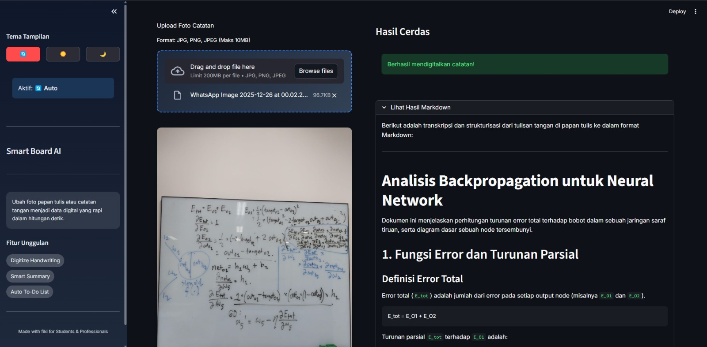

# SmartBoard AI

A Computer Vision-based application that transforms whiteboard photos and physical notes into structured digital assets.

## Application Preview

Here is a preview of the application interface processing notes:



## Key Features

### Digitize Notes
Converts handwriting from images into clean Markdown text documents. The AI enhances sentence structure and formatting to improve readability.

### Action Items Extraction
Analyzes meeting or lecture notes to automatically detect **Tasks**, **Person In Charge (PIC)**, and **Deadlines**, outputting the data in a structured JSON format.

## Tech Stack

* **Python 3.10**
* **Streamlit** (User Interface)
* **Google Gemini 1.5 Flash** (Multimodal LLM)

## How to Run

1.  **Clone the Repository**
    ```bash
    git clone [https://github.com/RifqiCah/vision-extractor.git](https://github.com/RifqiCah/vision-extractor.git)
    cd vision-extractor
    ```

2.  **Install Dependencies**
    ```bash
    pip install -r requirements.txt
    ```

3.  **Setup API Key**
    Create a `.env` file in the root directory and add your Google Gemini API Key:
    ```env
    GOOGLE_API_KEY=Paste_Your_API_Key_Here
    ```

4.  **Run the Application**
    ```bash
    streamlit run app.py
    ```

## Project Structure

```text
vision-extractor/
├── app.py                # Main Interface
├── services/             # AI Logic (Gemini)
├── config/               # Environment Configuration
└── utils/                # Helper Functions